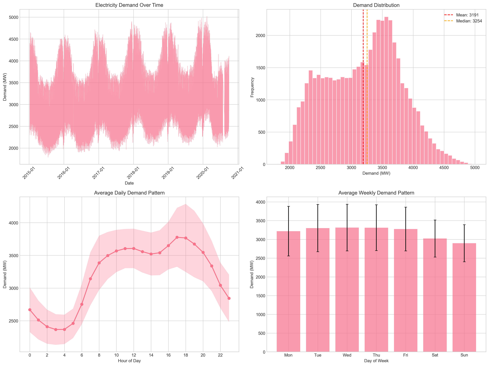
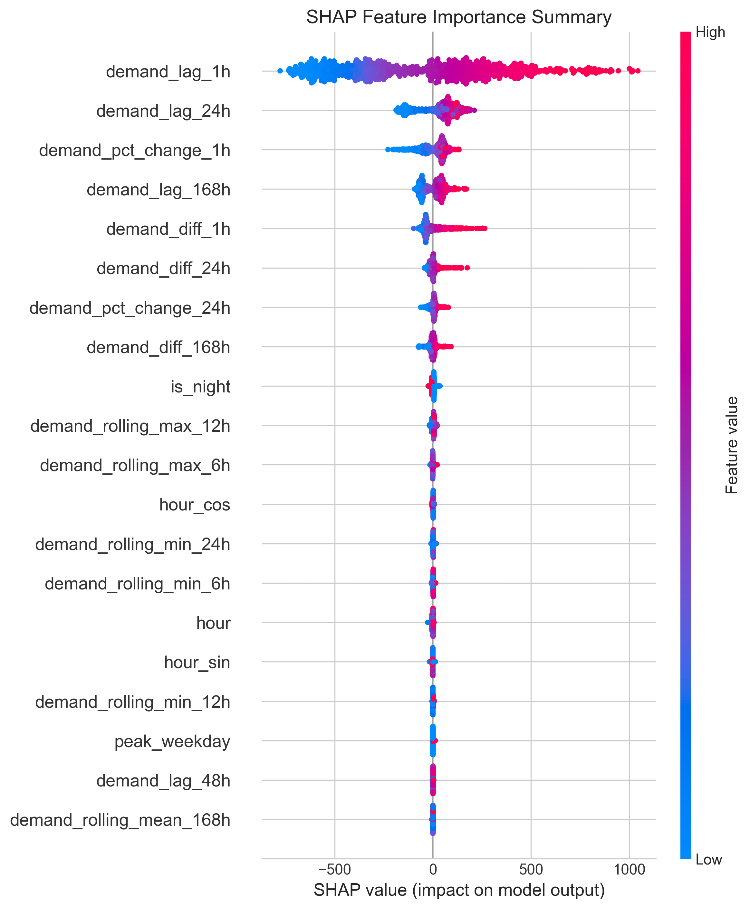
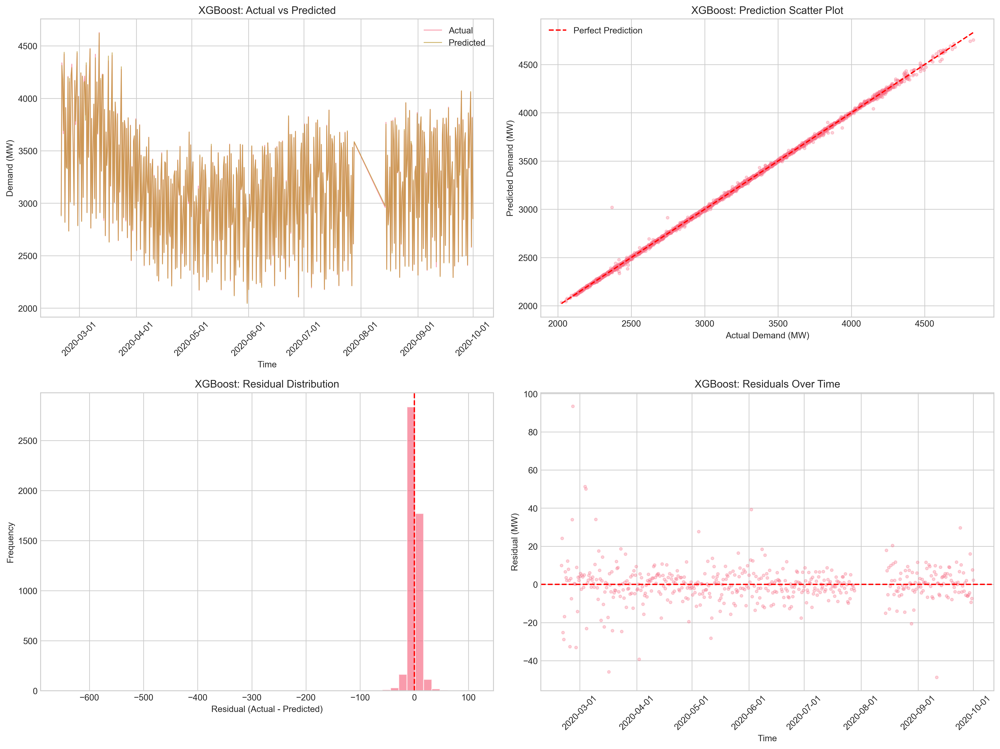

# Ireland Electricity Demand Forecasting

**Hybrid Interpretable Machine Learning Model for Hourly Electricity Demand Forecasting**

A reproducible framework combining XGBoost and LSTM with SHAP-based explainability for forecasting electricity demand in Ireland using Open Power System Data (OPSD).

---

## Research Objectives

1. Develop a **hybrid ML model** combining tree-based (XGBoost) and deep learning (LSTM) approaches
2. Implement **SHAP-based explainability** for transparent feature attribution
3. Evaluate **robustness under extreme demand conditions**
4. Create a **reproducible benchmark** using open-source data

---

## Results

### Model Performance

| Model | MAE (MW) | RMSE (MW) | MAPE | R² |
|-------|----------|-----------|------|-----|
| **XGBoost** | 6.27 | **13.50** | 0.20% | **0.9994** |
| Random Forest | 4.29 | 15.95 | 0.14% | 0.9992 |

### Top Features (SHAP Analysis)

| Rank | Feature | Mean \|SHAP\| |
|------|---------|---------------|
| 1 | demand_lag_1h | 367.29 |
| 2 | demand_lag_24h | 89.31 |
| 3 | demand_pct_change_1h | 50.75 |
| 4 | demand_lag_168h | 46.63 |
| 5 | demand_diff_1h | 43.79 |

### Extreme Event Performance

| Condition | RMSE | MAPE |
|-----------|------|------|
| Normal | 13.17 | 0.19% |
| High Demand | 21.86 | 0.37% |
| Low Demand | 6.53 | 0.23% |

---

## Project Structure

```
Prathima_Project/
├── config/
│   ├── __init__.py
│   └── config.py              # Configuration parameters
├── data/                      # Data storage (auto-downloaded)
├── models/                    # Saved trained models
├── notebooks/
│   └── electricity_demand_forecasting.ipynb
├── outputs/
│   ├── plots/                 # Visualizations
│   │   ├── demand_overview.png
│   │   ├── seasonal_patterns.png
│   │   ├── model_comparison.png
│   │   ├── xgboost_predictions.png
│   │   ├── xgboost_feature_importance.png
│   │   └── shap/              # SHAP explainability plots
│   └── results/               # Evaluation metrics
├── src/
│   ├── __init__.py
│   ├── data_loader.py         # OPSD data download & loading
│   ├── preprocessing.py       # Data cleaning & scaling
│   ├── feature_engineering.py # 54 engineered features
│   ├── models.py              # RF, XGBoost, LSTM, Hybrid
│   ├── evaluation.py          # Metrics & robustness testing
│   ├── visualization.py       # EDA & result plots
│   └── explainability.py      # SHAP analysis
├── main.py                    # Main execution script
├── requirements.txt           # Dependencies
└── README.md
```

---

## Installation

### Prerequisites
- Python 3.9+
- pip

### Setup

```bash
# Clone the repository
git clone https://github.com/Grumbled0rf/scripterr.git
cd scripterr/Prathima_Project

# Create virtual environment
python -m venv venv
source venv/bin/activate  # On Windows: venv\Scripts\activate

# Install dependencies
pip install -r requirements.txt

# For XGBoost on macOS, install OpenMP
brew install libomp
```

---

## Usage

### Run Full Pipeline

```bash
python main.py
```

### Command Line Options

```bash
python main.py --skip-eda      # Skip exploratory data analysis
python main.py --skip-shap     # Skip SHAP explainability
python main.py --force-download # Re-download OPSD data
```

### Interactive Jupyter Notebook

```bash
jupyter notebook notebooks/electricity_demand_forecasting.ipynb
```

---

## Data Source

**Open Power System Data (OPSD)** - Version 2020-10-06

- URL: https://data.open-power-system-data.org/time_series/2020-10-06/
- Coverage: 2015-01-08 to 2020-09-30
- Resolution: Hourly
- Records: 49,657 samples
- Target: `IE_load_actual_entsoe_transparency`

---

## Feature Engineering

**54 features** across 6 categories:

| Category | Features | Examples |
|----------|----------|----------|
| Temporal | 18 | hour, day_of_week, month, is_weekend, hour_sin/cos |
| Lag | 6 | demand_lag_1h, demand_lag_24h, demand_lag_168h |
| Rolling | 20 | rolling_mean_24h, rolling_std_48h, rolling_max_168h |
| Difference | 5 | demand_diff_1h, demand_pct_change_24h |
| Holiday | 2 | is_holiday, is_near_holiday |
| Interaction | 3 | hour_weekend, peak_weekday |

---

## Model Architecture

### XGBoost (Primary Model)
- 500 estimators
- Max depth: 8
- Learning rate: 0.05
- Subsample: 0.8

### Random Forest (Baseline)
- 300 estimators
- Max depth: 15

### Hybrid Model (XGBoost + LSTM)
- XGBoost for feature learning
- LSTM for residual temporal patterns
- Meta-learner for combination

*Note: LSTM requires TensorFlow installation*

---

## Visualizations

### Demand Patterns


### SHAP Feature Importance


### Model Predictions


---

## Key Findings

1. **Previous hour's demand** (`demand_lag_1h`) is the strongest predictor with SHAP importance of 367
2. **Daily and weekly patterns** captured by lag features (24h, 168h)
3. **Model achieves 99.94% variance explained** (R² = 0.9994)
4. **Higher errors during peak demand** periods (MAPE increases from 0.19% to 0.37%)
5. **Early morning hours** (2 AM, 6-8 AM) show highest prediction errors

---

## Citation

If you use this code for research, please cite:

```bibtex
@misc{ireland_electricity_forecasting,
  title={Hybrid Interpretable Machine Learning for Hourly Electricity Demand Forecasting in Ireland},
  author={Prathima Project},
  year={2024},
  url={https://github.com/Grumbled0rf/scripterr}
}
```

---

## References

- Open Power System Data: https://open-power-system-data.org/
- SHAP: https://github.com/slundberg/shap
- XGBoost: https://xgboost.readthedocs.io/

---

## License

This project is for academic research purposes.

---

## Acknowledgments

- Open Power System Data (OPSD) for providing transparent electricity data
- ENTSOE Transparency Platform for original data sources
